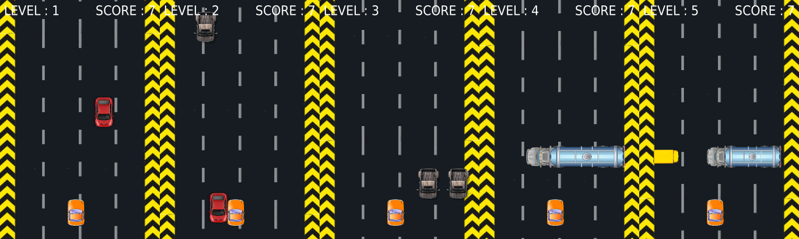
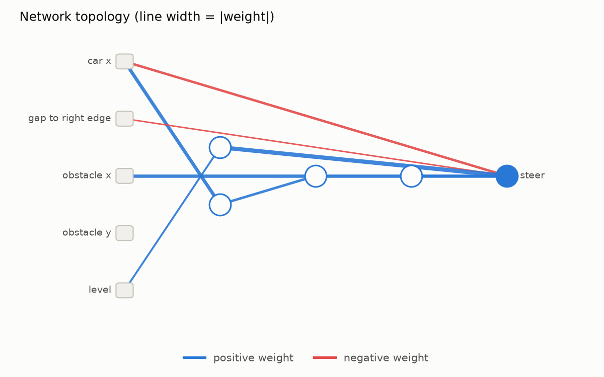

# Fuzzy Racer

A top-down traffic-dodging game written with [pygame-ce](https://pyga.me/), plus
an autopilot that learns to drive through **neuroevolution** with
[NEAT](https://neat-python.readthedocs.io/) (NeuroEvolution of Augmenting
Topologies).

You can:

- **play** a five-level campaign yourself with the arrow keys,
- **watch** the bundled, pretrained neural network drive,
- **train** a new network from scratch, either in a window (you watch the
  whole population race) or headless (as fast as your CPU allows).



## Overview

Fuzzy Racer is a 2D game written in Python with Pygame. The player controls a
car on a road and steers left or right to avoid obstacles, mostly trucks and
vans, that drive down towards it.

The game has several levels, and each one is harder than the last. Obstacles
move faster, more of them appear, and the gaps between waves change from
level to level.

Each kind of game object has its own class: the car, the obstacles and the
road background. The obstacle class has several images, so different types of
truck and other vehicles can appear.

The game also uses the NEAT (NeuroEvolution of Augmenting Topologies) library
to train an artificial neural network to play. NEAT is a genetic algorithm:
it evolves a population of neural networks, keeps the ones that drive best,
and breeds new ones from them. The network reads the game state, such as the
positions of the car and the nearest obstacle, and decides whether to steer
left or right.

A human can play the game, or the trained network can play it on its own.
After training, the best genome is saved and used as the autopilot, which the
game calls the "Neural Engine".

In short, the project is a working 2D Pygame game that either a human or an AI
agent can play, where the AI agent is trained by neuroevolution with the NEAT
algorithm.

## Installation

The package needs Python ≥ 3.10 and is installed with [uv](https://docs.astral.sh/uv/):

```bash
git clone https://github.com/faraz-tu-dortmund/fuzzy-racer.git
cd fuzzy-racer
uv pip install -e .
```

The graphical launcher uses Tkinter, which ships with most Python builds. On
Debian/Ubuntu you may need `sudo apt install python3-tk`. Everything else
works without it.

> **Note:** `pygame-ce` replaces the classic `pygame` package (it is still
> imported as `pygame`). Uninstall `pygame` first if it is in the same
> environment.

## Usage

```bash
uv run -m fuzzy_racer                 # open the graphical launcher
uv run -m fuzzy_racer play            # drive yourself (← / → to steer)
uv run -m fuzzy_racer ai              # watch the pretrained network
uv run -m fuzzy_racer train           # evolve a new network in a window
uv run -m fuzzy_racer draw-network    # save a diagram of a network
```

Every command accepts `--help`. The most useful options:

| Command | Option | Meaning |
|---|---|---|
| `play`, `ai` | `--seed N` | reproducible obstacle placement |
| `ai` | `--network FILE` | use a network JSON file instead of the pretrained one |
| `ai` | `--mode {ai,player}` | the endless training course (default) or the five-level campaign |
| `train` | `--mode {ai,player}` | train on the endless course (default) or the campaign |
| `train` | `--headless` | train without a window, much faster |
| `train` | `--generations N` | stop after *N* generations (default 1000) |
| `train` | `--output-dir DIR` | where the results go (default `results/training`) |
| `train` | `--config FILE` | a custom NEAT config ([default](src/fuzzy_racer/data/neat_config.ini)) |
| `train` | `--seed N` | reproducible training run |

Training stops when a network reaches the fitness threshold (10 000), when
the generation limit is reached, or when you close the window or press
Ctrl+C. The best network found so far is always saved.

### Using it as a library

Everything the CLI does is available from the top-level package:

```python
import fuzzy_racer as fr

network = fr.load_pretrained_network()
network.activate((265, 335, 300, 400, 2))  # -> [1.0], i.e. steer left

result = fr.train(20, headless=True, seed=1, output_dir="my_run")
fr.watch_ai(result.network)
```

## How it works

### The game

Obstacles drive down a scrolling road in *waves*. The next wave spawns once
the previous one has travelled a fixed distance, and a level is cleared once
all of its obstacles have passed. Each obstacle that passes scores one point.
Collisions are pixel-perfect (pygame masks). A crashed car is dragged along
by the obstacle it hit, and the game ends when that obstacle leaves the
screen.

| Level | Obstacles | Speed (px/frame) |
|---|---|---|
| 1 | 20 trucks/vans at random positions | 20 |
| 2 | same, faster and further apart | 40 |
| 3 | pairs of trucks snapped to five lanes | 35 |
| 4 | a road-wide tanker with a gap on the right | 30 |
| 5 | a tanker and a bus forming a slalom gap that switches sides | 30 |

### The autopilot

The network sees five inputs every frame: the car's `x`, its distance to the
right window edge, the nearest obstacle's `x` and `y`, and the level number.
It has one sigmoid output: above 0.5 steers left, below 0.5 steers right.

During training, all 500 genomes of a generation race the same course at the
same time. Fitness is **+0.1** per frame alive, **−2** per frame touching an
obstacle, **+1** per obstacle dodged and **+5** per level cleared. NEAT then
breeds the next generation, growing new neurons and connections where they
help.

Trained networks are stored as small JSON files
([`pretrained_network.json`](src/fuzzy_racer/data/pretrained_network.json)) and
evaluated by the package's own `Network` class. This avoids pickle, which
breaks whenever the NEAT library changes. The evaluator's outputs are
identical to neat-python's.

## Results

The file below was produced by the command shown and is committed to the
repository.

**Pretrained network**
(`uv run -m fuzzy_racer draw-network`) → [`results/pretrained_network.png`](results/pretrained_network.png)



It uses four hidden neurons and ignores the obstacle's `y` position entirely.

## Project layout

```
src/fuzzy_racer/
├── __init__.py      public API
├── __main__.py      `python -m fuzzy_racer` entry point
├── cli.py           argument parsing and sub-commands
├── settings.py      window size, speeds, sprite sizes
├── assets.py        locating and loading bundled images and data
├── sprites.py       Car, Obstacle, Road
├── levels.py        level definitions, wave patterns, ObstacleCourse
├── race.py          frame-by-frame simulation shared by every mode
├── display.py       window handling and HUD
├── game.py          human and AI single-car games
├── network.py       JSON-serialisable feed-forward network
├── training.py      NEAT training loop and fitness function
├── visualize.py     matplotlib plots (PNG)
├── menu.py          Tkinter launcher
└── data/            images, NEAT config, pretrained network
tests/               pytest suite (runs headless)
results/             generated plots and networks
```

## Development

```bash
uv run pytest              # run the test suite (no display needed)
uv run ruff check .        # lint (PEP 8, pydocstyle, import order, …)
uv run ruff format .       # format
```

## License

Released under the [MIT License](LICENSE).
